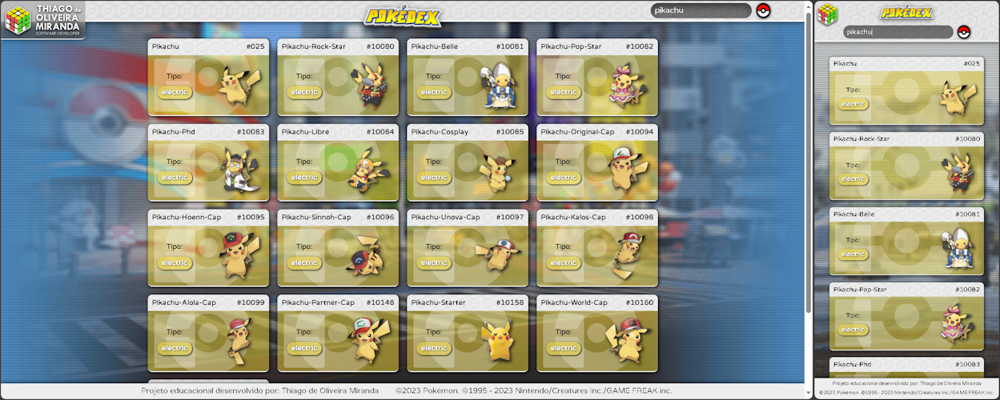
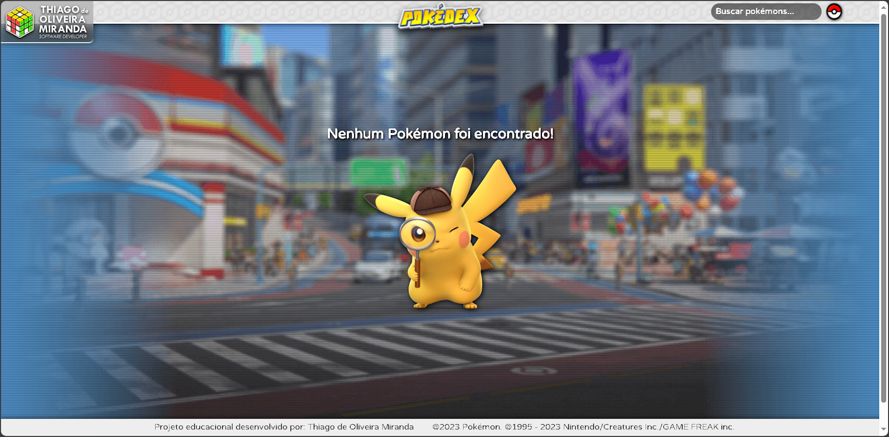

<p align="center">

</p>

**_Desenvolvido por:_** _Thiago de Oliveira Miranda_.&nbsp;&nbsp;&nbsp;|&nbsp;&nbsp;&nbsp;[Github](https://github.com/ThiagoOMiranda)&nbsp;&nbsp;&nbsp;|&nbsp;&nbsp;&nbsp;[LinkedIn](https://www.linkedin.com/in/thiago-de-oliveira-miranda-5393181a7/)

---

<p align="center"></p>

<h2 align="center">

**POKÉDEX JS 2.0 ( _Versão WebComponents_ )**

</h2>

<spam align="center">

https://thiagoomiranda.github.io/js-webcomponents-pokedex/

</spam>

---

<br>

### **`Sumário:`**

<p align="center">
    <a href="#escopo">Escopo do Projeto</a>&nbsp;&nbsp;&nbsp;|&nbsp;&nbsp;&nbsp;
    <a href="#recursos">Recursos Explorados</a>&nbsp;&nbsp;&nbsp;|&nbsp;&nbsp;&nbsp;
    <a href="#resultado">Resultado Obtido</a>&nbsp;&nbsp;&nbsp;|&nbsp;&nbsp;&nbsp;
    <a href="#design">Detalhes Visuais</a>&nbsp;&nbsp;&nbsp;|&nbsp;&nbsp;&nbsp;
    <a href="#implementos">Implementações</a>&nbsp;&nbsp;&nbsp;|&nbsp;&nbsp;&nbsp;
    <a href="#creditos">Créditos</a>
</p>

<br>

<br>

## **`Escopo do Projeto:`** <a name="escopo"></a>

&emsp;&emsp; Versão atualizada da Pokédex com intúito de aplicar os conceitos de **_Web Components_** em Javascript puro. Os principais recursos explorados no desenvolvimento deste projeto foram:

<br>

## **`Recursos Explorados:`** <a name="recursos"></a>

**API:** _(Application Programming Interface)_ ou Interface de Programação de Aplicativos, é um conjunto de regras e protocolos que permite que diferentes softwares se comuniquem e interajam uns com os outros. Ela define as maneiras pelas quais os programas podem solicitar e compartilhar dados e funcionalidades específicas. Para este projeto foi utilizada a **pokeAPI**.

**Fetch:** Conceito relacionado ao ato de realizar uma solicitação _(request)_ para obtenção informações ou dados de uma fonte externa, _API, banco de dados ou servidor web_. Neste projeto foi implementado a partir da função **_'fetch'_** do Javascript.

```
pokeApi.getPokemonInfo = async (pokemonID) => {
  const url = `https://pokeapi.co/api/v2/pokemon/${pokemonID}`;

  try {
    const infoResponse = await fetch(url); //Requisita dados da url.

    if (!infoResponse.ok) {
      throw new Error(`An error occurred: ${infoResponse.status}`);
    } //Verifica se a resposta retorna erro

    pokemonInfoData = await infoResponse.json(); // Aguarda a realização do request e converte para .json.
    return convertPokeApiInfoToPokemon(pokemonInfoData);
  } catch (error) {
    console.error("An error occurred within getPokemonInfo: ", error);
    throw error;
  }
};
```

<p align="center"><i>Estrutura simples de uma função de requisição utilizando fetch data.</i></p>

<br>

**Promises:** Promises (promessas) são objetos JavaScript que representam o resultado eventual (concluído ou falha) de uma operação assíncrona. Elas são usadas para lidar com código assíncrono de maneira mais estruturada, permitindo que você encadeie operações e trate erros de forma mais eficiente.

<br>

**Async/Await:** É uma maneira de escrever código _assíncrono_ de forma _síncrona e mais legível_. A palavra-chave **_async_** é usada para definir funções assíncronas, enquanto **_await_** é usado dentro dessas funções para esperar que Promises sejam resolvidas, permitindo que o código continue de forma síncrona. Isso simplifica o tratamento de código assíncrono e torna o fluxo de controle mais claro.

```
const responseData = await response.json(); // Request inicial dos dados gerais de uma lista de pokemons
    const pokemons = responseData.results;
    const detailRequests = pokemons.map(pokeApi.getPokemonInfo); // request individual de detalhes de cada pokemon.
    const pokemonsDetails = await Promise.all(detailRequests); // a "espera" para a conclusão de todos os requests anteriores.

    return pokemonsDetails;
```

<p align="center"><i>Aplicação básica de promisses no escopo de uma função request.</i></p>

<br>

**Web Components:** Ou _Componentes Web_, em JavaScript é um conjunto de tecnologias que permite criar elementos HTML _personalizados_ e _reutilizáveis_, encapsulando estrutura, estilo e comportamento em componentes independentes, facilitando o desenvolvimento web modular e provendo um código mais limpo.

```
class PokemonCard extends HTMLElement { // Cria uma nova classe que estende a classe "HtmlElement".
  constructor() {
    super();

    const shadow = this.attachShadow({mode: "open"}); // Parâmetro que especifica que o shadow DOM é acessível e modificável a partir de JavaScript externo.

    shadow.appendChild(this.build()); // Insere os elementos encapsulados na shadow DOM.
    shadow.appendChild(this.styles()); // Insere as configurações de estilos do componente na shadow DOM.
  }

  styles() {
    const style = document.createElement("style");
    style.textContent = `
      //Onde estilos são declarados como na  folha de estilos: CSS.
    `;

    return style;
  }

  build() {
    const componentRoot = document.createElement("div");
    // Onde os elementos Html que estão presentes em página são criados e encapsulados na shadowDOM.
  }

  setData() {
    // Função interna do componente criada para "setar" as variáveis e dados a serem manipulados pelo componente.
  }
}

customElements.define("pokemon-card", PokemonCard); // Registra um novo elemento personalizado (custom element) no navegador usando a API de Custom Elements do Web Components.
```

<p align="center"><i>Estrutura básica de um Custom Element / Web Components.</i></p>

<br>

**Model Classes:** Ou _classes de modelo_, elas mapeiam os dados recebidos da API para objetos em JavaScript, tornando mais fácil acessar e manipular esses dados em todo o projeto. Isso promove um código mais limpo, legível e manutenível, além de permitir que os desenvolvedores tenham uma representação clara dos dados, facilitando a interação com a API e evitando erros comuns de manipulação de dados.

```
class PokemonDetail {
  number;
  name;
  type;
  types = [];
  image;
}
```

<p align="center"><i>Classe utilizada no projeto para organizar os dados coletados na API.</i></p>

<br>

---

<br>

&emsp;&emsp;Parte importante e adicional da atividade foi customizar o código, adicionar melhorias e características próprias com ênfase no aprendizado e na aplicação de novos métodos e funções do Javascript,CSS e HTML.

<br>

---

### **`Resultado Obtido:`** <a name="resultado"></a>

<p align="center"></p>

<p align="center"><i>Figura 01: Tela final do projeto.</i></p>

---

### **`Detalhes Visuais:`** <a name="design"></a>

<p align="center"></p>

<p align="center"><i>Figura 02: Retorno de busca sem resultados.</i></p>

---

### **`Implementações:`** <a name="implementos"></a>

- [x] "_Mobile First_" e _responsividade_ para dispositivos móveis e desktops.
- [x] Backgrounds rotativos transicionados em loop.
- [x] Logomarca em SVG animada com _@keyframes_ no CSS.
- [x] Busca por nome e número do Pokémon.
- [x] Condição que gera a paginação se a quantidade de retorno da busca for maior que 20 elementos.
- [x] Condição que define as regras comportamentos diferenciados para a animação de carregamento do botão "_loadMore_" em desktops e dispositivos móveis.
- [x] Background dinâmico para cada card pokemon em função do tipo.

<br>

---

### **`Créditos:`** <a name="creditos"></a>

&emsp;&emsp;Este projeto possui caráter didático e educacional, sem fins comerciais. Todos os direitos sobre a franquia, marca, personagens, gráficos correlatos à Pokemon pertencem à:

©2023 Pokémon. ©1995 - 2022 Nintendo/Creatures Inc./GAME FREAK inc. TM, ®Nintendo.

<br>

---

<p align="center">

</p>
